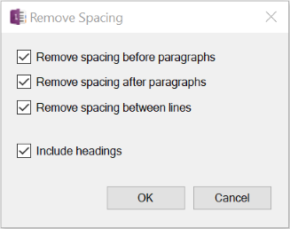
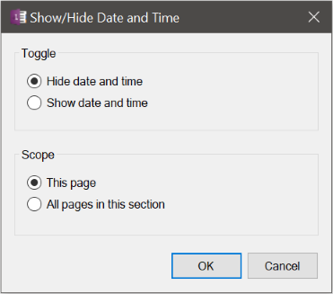

## Change Sentence Spacing
Reformats the current page to consistently set spacing between sentences to either one or two spaces. 

Note that this may not be perfect! It looks for periods (.), exclamation marks (!), and semi-colons (;) that follow alpha-numeric strings. This means it may change the spacing between abbreviation such as "H. G. Wells!"

## Clear Background Color
Clears the highlight background of text or the shading of table cells and also resets the text color to maintain readability against the default background. This is useful for quickly resetting the styling of content copied and pasted from the Web that uses a dark background when pasting onto a light page. Affects either the selected content or the entire page if there is no selected region.

## Remove Author Information
Removes all author information from the current page

## Remove Citations
Removes citations that OneNote auto-generates when you paste screen clipping and parts 
of Web pages into OneNote, for example `From <https://www....`

## Remove Empty Paragraph and Headers
Removes empty headings with no content and "extra" empty lines between paragraphs, e.g.,
two or more lines compressed down to one line.

This command also attempts to align indented and outdented blank lines with the surrounding
content so that consecutive paragraphs can be collapsed below a shared heading.

## Remove Paragraph Spacing
Resets line spacing to zero between all paragraphs and headings
> 

## Show/Hide Page Date and Time Stamps
Toggles the page date and time stamps under the title on the current page or all pages in
the current section
> 

## Trim Whitespace
Trims trailing whitespace from selected text or all text on the page

