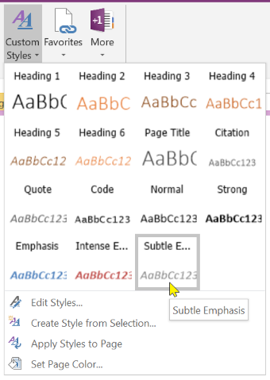
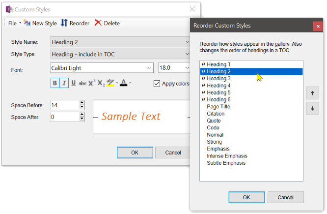
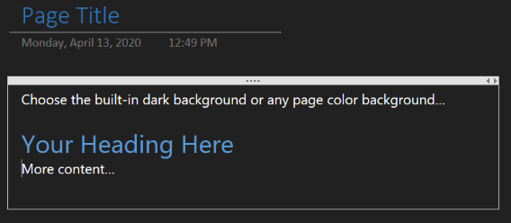
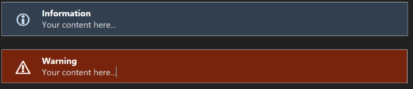

# Custom Styles

The Custom Styles gallery and Editor provide an easy way to create new styles from scratch
or from the currently selected text, modify those styles and save them for later use. You
can then either apply a single style to selected text by choosing a style from the gallery
or use the *Apply Custom Styles to Page* command to apply all custom styles to the entire
page, looking for headers, citations, quotes, code, and normal text.

The first nine custom styles are automatically bound to the key sequences
Ctrl+Alt+Shift + 1, Ctrl+Alt+Shift + 2, etc., through Ctrl+Alt+Shift + 9

| Styles Gallery | Styles Editor |
| -------------- | ------------- |
|  |  |

## Office Black Theme and Custom Page Background

By default, OneNote lets you select from a light, pastel pallet for page backgrounds but it
if you change the Office theme to _Black_ then it does a fairly decent job of colorizing your
content and the OneMore custom styles work just fine. 

But if you don't want to affect all Office products then OneMore offers true dark-mode background
capabilities as well as custom page color selections. And OneMore comes with a style theme named
DarkStyles.xml that you can load.

_Please see the pinned "Known Issues" item in the Issues area for an explanation of why
colors might not look right when switching to a dark background._

If you've selected a darker page background color, OneMore will generate the information box,
warning box, and code box with darker colors as well, such as:

***

# Favorites

Although OneNote has multiple slick ways of navigating around notebooks, sections, and pages,
the most obvious feature missing is a Favorites menu. Well, you now have one with OneMore.

> 

Note that you can also add a section to the favorites menu by right-clicking on the section itself
and choosing _Add to Favorites_. When the section favorite is clicked, focus is returned to the
most recently visited page in that section.

### Add current page
Adds the current page to the end of the favorites menu.

### Manage Favorites
Opens the Settings dialog and shows the Favorites Manager sheet

### Save Custom Snippet
Saves the selected content as a new named snippet. Once saved, the snippet can be inserted onto any page, at any location, by clicking the snippet on the Favorites menu.

Snippets can be used to easily insert repeatable content such as custom styled tables, blocks of text, signature lines, etc.

### My Saved Plugins
If you've created and saved custom plugins, they will be listed as a separate sub-menu off of the Favorites menu.
Click the _Manage Saved Plugins_ item to open the Plugin Manager where you can edit, rename, or delete plugins.
Or click a plugin from the menu to immediately invoke it.

### Manage Custom Snippets
Opens the Settings dialog and shows the Snippets Manager sheet

### OneNote Keyboard Shortcuts
This is a special link that can be enabled in the [Favorites Manager](Settings).

The first time this link is clicked, OneMore will download an import and keyboard shortcuts reference page under the current section and show that page. It may take a couple of seconds to appear.

Subsequent clicks will simply show that page again. 

This page can be moved to any open notebook or section and OneMore will still find it. If the page is deleted, clicking the Favorite link will download it again.