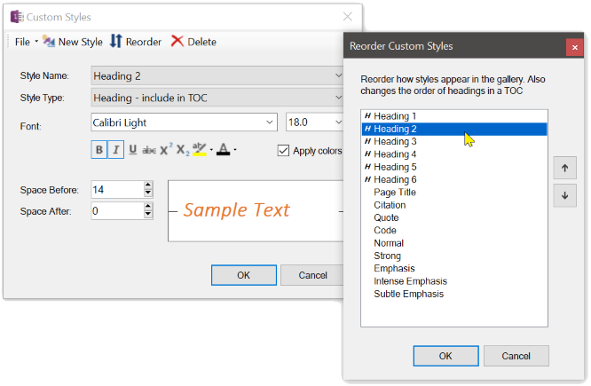
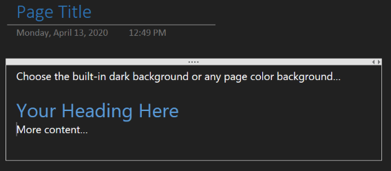
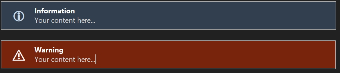

The Custom Styles gallery and Editor provide an easy way to create new styles from scratch
or from the currently selected text, modify those styles and save them for later use. You
can then either apply a single style to selected text by choosing a style from the gallery
or use the *Apply Custom Styles to Page* command to apply all custom styles to the entire
page, looking for headers, citations, quotes, code, and normal text.

The first nine custom styles are automatically bound to the key sequences
Ctrl+Alt+Shift + 1, Ctrl+Alt+Shift + 2, etc., through Ctrl+Alt+Shift + 9

| Styles Gallery | Styles Editor |
| -------------- | ------------- |
|  |  |

## Office Black Theme and Custom Page Background

By default, OneNote lets you select from a light, pastel pallet for page backgrounds but it
if you change the Office theme to _Black_ then it does a fairly decent job of colorizing your
content and the OneMore custom styles work just fine. 

But if you don't want to affect all Office products then OneMore offers true dark-mode background
capabilities as well as custom page color selections. And OneMore comes with a style theme named
DarkStyles.xml that you can load.

_Please see the pinned "Known Issues" item in the Issues area for an explanation of why
colors might not look right when switching to a dark background._

If you've selected a darker page background color, OneMore will generate the information box,
warning box, and code box with darker colors as well, such as:

