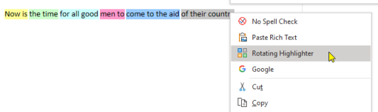

## Colorize
Applies colorized syntax highlighting to selected source code. Supported languages include: 

- C#
- CSS
- HTML
- Java
- JavaScript/JSON
- PowerShell
- Python
- Typescript
- VB
- XML
- YAML

For best results, first select the text you want to colorize, set the style to Code, and then colorize the selection.

The highlighting is not as complete as you might find in VS or VSCode but then OneNote isn't intended to be a programming editor anyway. However, languages are defined in JSON definition files located below the OneMore installation directory so they can be customized and enhanced and new languages can be added.

If you're so inclined to add enhancements or define a new language, please submit a pull request.

## Collapse Outlining
Collapses all headings with indented content.

## Expand Outlining
Expands all headings with indented content.

## Increase Font Size (Ctrl + Alt + Plus)
Increases the font size of all text on the entire page. To increase the font size of selected text, use the built-in OneNote shortcut Ctrl+Shift+>

## Decrease Font Size (Ctrl + Alt + Minus)
Decreases the font size of all text on the entire page. To decrease the font size of selected text, use the built-in OneNote shortcut Ctrl+Shift+<

## To UPPERCASE (Ctrl + Shift + Alt + U)
Converts the selected text to uppercase.

## To lowercase (Ctrl + Shift + U)
Converts the selected text to lowercase.

** To Title Case
Converts the selected text to title case.

## Enable Spell Check
Enables spell checking on the current page or for the selected text by
resetting the proofing language of the page to your default culture, e.g. "en-US"

## Disable Spell Check (F4)
Disables spell checking on the current page or for the selected text by
setting the proofing language of the page to "yo".

## Invert Selection
Inverts the selection on the current page, de-selecting all selected content and selecting all non-selected content.

## Join Paragraph
Joins multiple selected consecutive lines into a single paragraph, eliminating soft-breaks.

## Paste Rich Text (Ctrl + Alt + V)
Pastes rich text from the clipboard, preserving formatting and colors.

## Restore Collapsed Outline
Restores the collapsed date of all collapsible headings since the last Save Collapsed Outline command was invoked. If the state was never saved, all headings are expanded.

## Rotating Highlighter
Uses a rotating array of colors to highlight selected text. Each time you select text and use this command, it will highlight the selected text using the next color in the array. Choose the color theme from the Settings dialog.
> 

## Save Collapsed Outline
Saves the current collapsed state of all collapsible headings; these are headings with indented content. This state can be restored at any time using the Restore Collapsed Outline command.

