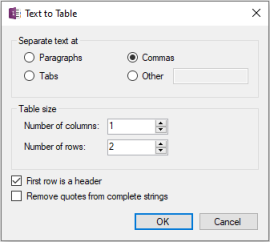
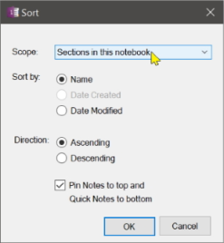

## Analyze Data Sizes
Generate a report, as a new page in this current section, showing how much disk space is consumed by OneNote notebooks and their recycle bins, sections, and pages. Shows orphaned notebook backups that are no longer opened in OneNote. Shows the size of the OneNote internal cache. Shows a detailed breakdown of image sizes and file attachments embedded on pages along with an indication if the source of a file attachment no longer exists. 

Each OneNote notebook maintains its own recycle bin. This can be cleared from the OneNote History menu.

Notebooks can be stored locally in the default OneNote data folder. Or they can be stored remotely in the cloud on OneDrive. Local notebooks are reported directly from the default data folder. Remote notebooks can only be analyzed by looking at their local backup copies as configured in the OneNote Options. _The backup feature must be enabled in OneNote options and run at least once in order for the report to show useful information for remote notebooks._

_Note that the detailed page analysis, especially when done over all sections in a notebook, can take some time to generate and result in a very large report page._

## Collapse Pages
Collapses the page hierarchy to see only top-level pages.

> 

## Copy Section Group
Accessed by right-clicking a section group, copies a section group (folder) to another notebook or section group. Note that sections on each level of the hierarchy must have unique names. If there are two sibiling sections with the same name then pages may be copied only to the first section.

## Date stamp pages in section
Prepends the title of each page with the created date of the page using the form YYYY-MM-DD.
If a page title already contains that value, no changes are made. This command is available
from the Extra menu or by right-clicking a section.

## Insert Pronunciation
Inserts the "ruby text" pronunciation of selected words. This uses an online service that supports over a dozen languages.

## Insert Timer Value (F2)
Inserts the current value shown in the timer window. The timer window must be started using the Start Timer command.

## Sort
Sorts pages, sections, or notebooks. Pages are sorted within the current section only,
not recursively throughout the notebook. Sections are sorted throughout the current
notebook recursively.

> 

## Start Timer (Alt + F2)
Starts and opens a visual timer. This small window will first appear in the upper right corner of the display and immediately starts counting seconds, minutes, and hours. There are three controls on the window: copy the current value to the clipboard, restart the timer from zero, and close the timer. The window can be moved but is limited to the current desktop window. 

> 

The current value shown in the timer window can easily be inserted into the body of the open page by using the Insert Timer command.

## Strikethrough Completed To Do Tags
Toggles strikethrough text next to all completed/incompleted tags
