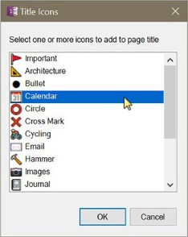

## Add Icon to Page Title
Chose from a selection of icons from the Segoe UI Emoji font to add to the page title;
OneNote automatically displays that icon in the page navigator as well.

> 

## Collapse Pages
Collapses the page hierarchy to see only top-level pages.

## Convert Text to Table
Converts selected text to a table. Text must be delimited by a comma, space, or other special character so the command can detect columns.

> 

## Date stamp pages in section
Prepends the title of each page with the created date of the page using the form YYYY-MM-DD.
If a page title already contains that value, no changes are made. This command is available
from the Extra menu or by right-clicking a section.

## Insert Table Cells
Adds the ability to insert cells into a table, shifting existing content down or to the right.
This is similar to the Excel functionality with one enhancement - if you select a rectangular
region of cells then it will shift just those cells, possibly overwriting other cells. If you
select cells from one column or cells from one row then it will insert cells above or to the left
and add rows or columns as needed to make room for the new cells.

> 

_Note that if you move cells with formulas, the cell references in those formulas are not updated
automatically by this command; you'll need to adjust those manually._

## Insert Pronunciation
Inserts the "ruby text" pronunciation of selected words. This uses an online service that supports over a dozen languages.

## Merge pages
Merges two or more pages into a single page. If every selected page contains exactly one outline each then the content of the outlines is concatenated to the outline in the target page, resulting in a single outline. However, if at least one page has multiple outlines then all outlines are appended vertically on the target page to preserve formatting and relative positioning. 

Outlines are used in variety of ways, not the least of which to preserve some conceptual context with other containers on the page based on size and position, so OneMore doesn't attempt to merge containers from multiple pages but instead preserves the layout of containers from each page in a continuous stream in the newly merged page.

Note that you can easily merge to containers by Shift+clicking one container and dragging it on top of the container with which you want the first to be merged. This is a built-in OneNote feature.

## Sort
Sorts pages, sections, or notebooks. Pages are sorted within the current section only,
not recursively throughout the notebook. Sections are sorted throughout the current
notebook recursively.

> 

## Split Page
Splits the current page at each Heading1 or page links. Also, these can be filtered by an optional tag. 

This will create new pages in the current section. If splitting on page links, if the linked pages exists, it must exist in the current section or it will not be found and a new page will be created in the current section; if it is found then the content will be appended to that page. 

## Split Table
Splits the current table starting at the row containing the input cursor. Optionally, the header can be duplicated in the new table and columns in both can be fixed to their current widths so the two tables remain aligned.

## Strikethrough Completed To Do Tags
Toggles strikethrough text next to all completed/incompleted tags
