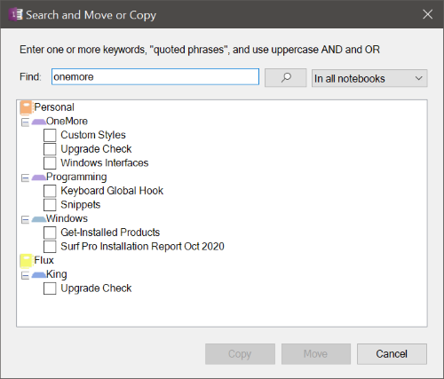

## Add Icon to Page Title
Chose from a selection of icons from the Segoe UI Emoji font to add to the page title;
OneNote automatically displays that icon in the page navigator as well.

> 

## Collapse Pages
Collapses the page hierarchy to see only top-level pages.

## Convert Text to Table
Converts selected text to a table. Text must be delimited by a comma, space, or other special character so the command can detect columns.

> 

## Insert Table Cells
Adds the ability to insert cells into a table, shifting existing content down or to the right.
This is similar to the Excel functionality with one enhancement - if you select a rectangular
region of cells then it will shift just those cells, possibly overwriting other cells. If you
select cells from one column or cells from one row then it will insert cells above or to the left
and add rows or columns as needed to make room for the new cells.

> 

## Insert Pronunciation
Inserts the "ruby text" pronunciation of selected words. This uses an online service that supports over a dozen languages.

## Merge pages
Merges two or more pages into a single page preserving formatting and position of outlines.

## Replace URLs with Web Page Titles
Automatically replaces all or selected hyperlinked URLs with the &lt;title> specified on the 
associated Web pages. This only affects URLs for which the displayed text is the same as the
link address, meaning if you've already customized the displayed text, OneMore will not alter
your changes.

For example, given this URL on a OneNote page: [https://github.com/](https://github.com/)

it would be replaced with its hyperlinked title: [GitHub](https://github.com)

## Search and Copy/Move
Searches for keywords across pages and copies or moves selected pages (Alt + F) to another section

> 

## Sort
Sorts pages, sections, or notebooks. Pages are sorted within the current section only,
not recursively throughout the notebook. Sections are sorted throughout the current
notebook recursively.

> 

## Strikethrough Completed To Do Tags
Toggles strikethrough text next to all completed/incompleted tags
