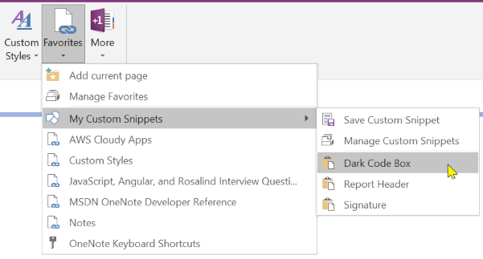

Although OneNote has multiple slick ways of navigating around notebooks, sections, and pages,
the most obvious feature missing is a Favorites menu. Well, you now have one with OneMore.

> 

### Add current page
Adds the current page to the end of the favorites menu.

### Manage Favorites
Opens the Settings dialog and shows the Favorites Manager sheet

