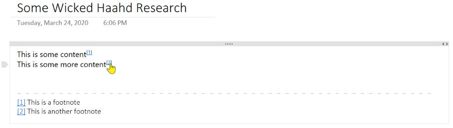

Adding footnotes to a OneNote page seems somehow redundant but consider how often OneNote
is used for research and then used to copy/paste content into Word or print as PDF... yeah,
you get it then.

## Add Footnote
You can add a footnote anywhere on the page and a reference label is inserted at the current
cursor location and a footnote is added to the bottom of the page. You can then edit the
text in that footnote to your heart's desire. Text colors are based on the page background color.

> 

Note that footnotes are hyperlinked so you jump from the content body down to the text
of a footnote or back up again to the content that references a particular footnote.

## Remove Footnote
And if you no longer want a footnote, place the cursor over the label or over the footnote
text at the bottom of the page and click the *Remove footnote* command. Voila!

OneMore keeps track of footnotes and will automatically reorder them to keep them numbered
sequentially from the top of the page. If you delete a footnote, it again will renumber
the remaining footnotes so there are no gaps. Pretty slick, huh?
