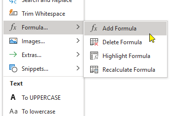
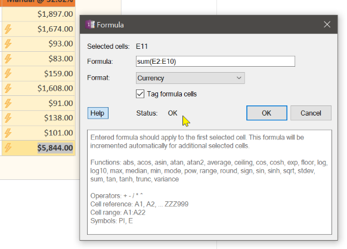

OneNote lets you insert an Excel table on a page or convert a table to an Excel object. This is
convenient if you want complicated formulas and charts... and you have Excel installed! But what
if you don't?

OneMore adds Excel-like formula functionality to native OneNote tables. Thanks to the work done
by [Jonathan Wood](http://www.blackbeltcoder.com/Articles/algorithms/a-c-expression-evaluator)
to create a fantastic expression parser and evaluator, you can now apply a formula to one or more
selected cells in a table. A formula can consist of basic mathematical operators, parenthesis,
and most math functions such as abs, sum, average, sin, etc.

| Formula Menu | Formula Dialog |
| ------------ | -------------- |
|  |  |

1. Select the cell or cells into which you want to add a formula; they must be linear and
   contiguous, meaning in the same row or in the same column.
1. Select the Add Formula command. The Formula dialog is displayed showing the names of the
   selected cells: A1, A2, A3, etc.
1. Enter the formula. As you type, OneMore validates the syntax in real-time, showing whether
   the formula is valid or invalid. Only when it is valid will the OK button be enabled.
1. Choose the format of the result: Number, Currency, or Percentage.
1. Choose whether you want to tag the cell with a lightning bolt to make it easy to identify
   cells with formulas in them.
1. Click OK.

If you use cell references in your formula and you've selected more than one cell then OneMore
will automatically increment the references relative to each seleted cell. For example, if you
select cells A10, B10, and C10 and enter the formula sum(A1:A9) then that will apply to A10, 
sum(B1:B9) will apply to B10, and sum(C1:C9) will apply to C10.

Formula processing is not recursive. This means that if cell A1 has a formula "A2+1" and cell
A2 has a formula "1+1", then when A1 is calculated, it will not force A2 to be recalculated.
Instead, each cell is calculated in order, top-down and left-to-right across the table.

The Recalculate command will recalculate all formulas in the selected table(s).

The Highlight command will select all cells on the page containing formulas so you know where
you put them.

The Delete command will remove a formula from the selected cell(s) but retain the values displayed
in those cell.
