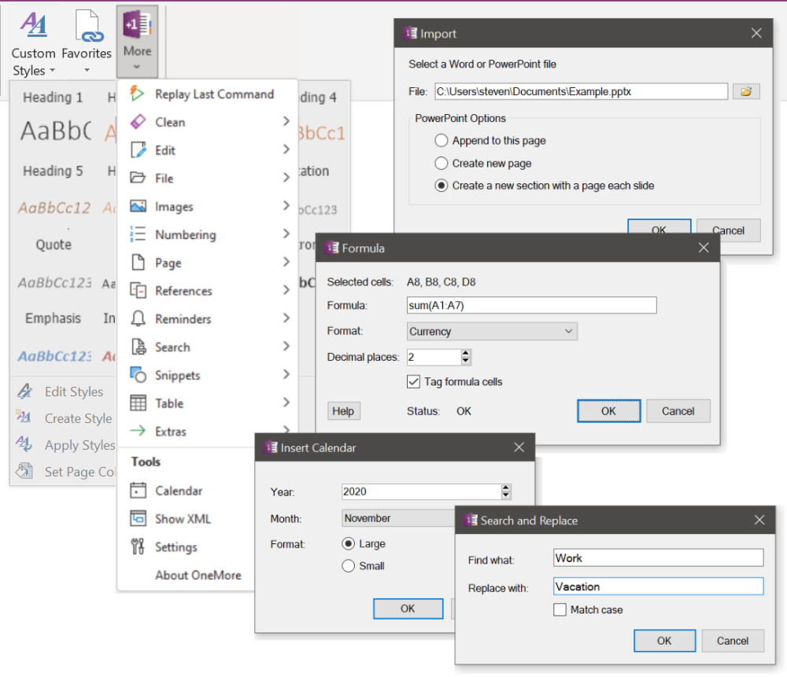

OneMore is an add-in for Microsoft OneNote 2019 that adds powerful yet simple and effective features.

* Access all features from the [OneMore group menus](../../wiki) added to the Home ribbon
* Access some "key" features using [keyboard shortcuts](#keys) (see what I did there?)
* Create/edit/apply [custom styles](../../wiki/Custom-Styles) with advanced options
* Manage menu of [Favorites](../../wiki/Favorites) for one-click link to your most referenced pages
* Add [formulas](../../wiki/Formula-Commands) to table cell using Excel-like expressions
* [Customize the context menu](../../wiki/Settings) to add OneMore commands or a a custom search engine

*Want more from OneMore? OneMore has more...* Click the pages on the right to discover all the gritty details ---->

### Minimum Prerequisites
* Developed for Windows 10
* Microsoft Visual Studio 2019, C# 7
* Microsoft Visual Studio 2019 Installer Projects extension
* .NET Framework 4.8
* Microsoft OneNote 2016 32-bit or 64-bit

Tested recently with Windows 10 2004 (19041.450), VS2019, and OneNote 2019/O365

### How to Install
1. Close OneNote if it is currently running
2. Download the [latest installer from here](https://github.com/stevencohn/OneMore/releases/latest)
3. Right-click the downloaded installer msi and choose Properties, then tick the Unblock box and click OK
4. Run the installer
5. Run OneNote and enjoy

## Key Shortcut Bindings
While all commands can be accessed from the OneMore ribbon group menus, some
commands also have their own key bindings.

| Category    | Command                       | Key Binding |
| ----------- | ----------------------------- | ----------- |
| [Editing](../wiki/Edit-Commands) | No Spell Check | F4
|             | Paste Rich Text               | Ctrl + Alt + V
|             | Search and Move/Copy          | Alt + F
|             | Search and Replace            | Ctrl + H
|             | To uppercase                  | Ctrl + Shift + Alt + U
|             | To lowercase                  | Ctrl + Shift + U
|             | Increase font size            | Ctrl + Alt + Plus
|             | Decrease font size            | Ctrl + Alt + Minus
| [Footnotes](../wiki/Footnote-Commands) | Add footnote | Ctrl + Alt + F
|             | Remove footnote               | Ctrl + Shift + F
| [Formulas](../wiki/Formula-Commands) | Add/Edit formula | F5
|             | Recalculate formulas          | Shift + F5
| [Snippets](../wiki/Snippets-Commands) | Insert Code Block | F6
|             | Insert horizontal line        | Shift + Alt + Minus
|             | Insert double horizontal line | Shift + Alt + Equals
| [Tools](../wiki/Tools) | Show XML                      | Ctrl + Shift + Alt + X
|             | Dump diagnostic info to log   | F8
|             | Clear the diagnostic log file | Ctrl + F8