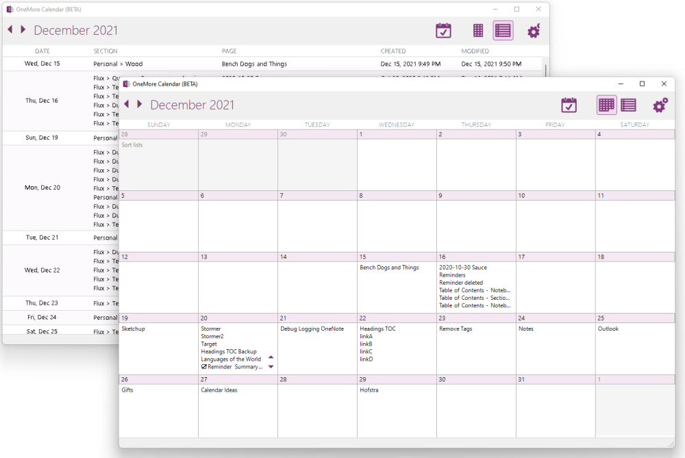

OneMore is an add-in for Microsoft OneNote 2019/2021 that adds powerful yet simple and effective features.

* Integrated with the OneNote ribbon, [context menus](#ctxmenus), and [keyboard shortcuts](#keys) for easy access
* [Customize the Text context menu](Settings) to add OneMore commands or a a custom search engine
* Apply [colorized syntax highlighting](Edit-Commands) to snippets of source code
* Create/edit/apply [custom styles](Custom-Styles-and-Favorites) with advanced options
* Manage menu of [Favorites](Custom-Styles-and-Favorites#Favorites) for one-click link to your most referenced pages
* Add [formulas](Table-Commands) to table cell using Excel-like expressions

*Want more from OneMore? OneMore has more...* Click the pages on the right to discover all the gritty details ---->

### The new Calendar app

### Minimum Prerequisites
* Developed for Windows 10
* Microsoft Visual Studio 2019, C# 7
* Microsoft Visual Studio 2019 Installer Projects extension
* .NET Framework 4.8
* Microsoft OneNote 2016 32-bit or 64-bit (should also work with OneNote 2013)

Tested recently with Windows 10 2004 (19041.450), VS2019, and OneNote 2019/O365

### How to Install
1. Close OneNote if it is currently running
2. Download the [latest installer from here](https://github.com/stevencohn/OneMore/releases/latest)
3. Right-click the downloaded installer msi and choose Properties, then tick the Unblock box and click OK
4. Run the installer
5. Run OneNote and enjoy

If you have issues, see the quick [trouble shooting guide](Troubleshooting). If that doesn't solve your issue then please [submit a new ticket](https://github.com/stevencohn/OneMore/issues/new/choose).

## Extended Context Menus
OneNote presents different context menus when you right-click on different parts of its UI. OneMore extends some of these default context menus to add its own commands.

* The default Text context menu [can be customized](Settings) to add a number of editing commands
* Right-click a picture to add a caption, crop, or resize the image
* Right-click a notebook to add or remove numbering to all notebooks, sort sections in a notebook
* Right-click the notebook panel background to sort all notebooks
* Right-click a section to sort pages within a section
* Right-click a page in the page navigation panel to export, split, or merge pages, or to sort child pages
* Right-click the page navigation panel background to add or remove numbering to pages or sort pages in the section
* Right-click a section or notebook to archive all pages in that context

## Key Shortcut Bindings
While all commands can be accessed from the OneMore ribbon group menus, some
commands also have their own key bindings. These default bindings can be customized in the Settings dialog.

See also OneNote's 
[built-in keyboard shortcuts here](https://support.microsoft.com/en-us/office/keyboard-shortcuts-in-onenote-44b8b3f4-c274-4bcc-a089-e80fdcc87950)

| Category    | Command                       | Key Binding |
| ----------- | ----------------------------- | ----------- |
|             | Replay Last Command           | Alt + Shift + R
| [Editing](../wiki/Edit-Commands) | No Spell Check | F4
|             | Rotating Highlighter          | Ctrl + Shift + H
|             | Paste as Text                 | Ctrl + Shift + V
|             | Paste Rich Text               | Ctrl + Alt + V
|             | To uppercase                  | Ctrl + Shift + Alt + U
|             | To lowercase                  | Ctrl + Shift + U
|             | Increase font size1            | Ctrl + Alt + Plus
|             | Decrease font size            | Ctrl + Alt + Minus
| [Footnotes](../wiki/Reference-Commands) | Add footnote | Ctrl + Alt + F
|             | Remove footnote               | Ctrl + Shift + F
| [Search](../wiki/Search-Commands) | Search and Replace | Ctrl + H
|             | Search and Move/Copy          | Alt + F
|             | Tag page                      | Alt + T
|             | Find tagged pages             | Ctrl + Alt + T
| [Snippets](../wiki/Snippets-Commands) | Insert Code Block | F6
|             | Insert horizontal line        | Shift + Alt + Minus
|             | Insert double horizontal line | Shift + Alt + Equals
|             | Insert Sortable Date          | Ctrl + Shift + D
| [Tables](../wiki/Table-Commands) | Add/Edit formula | F5
|             | Recalculate formulas          | Shift + F5
|             | Fill Down                     | Ctrl + D
| [Extras](../wiki/Extra-Commands) | Add or Update Reminder | F8
|             | Start Timer                   | Alt + F2
|             | Insert Timer Value            | F2
| [Tools](../wiki/Tools) | Show XML | Ctrl + Shift + Alt + X
|             | Dump diagnostic info to log   | Shift + F8
|             | Clear the diagnostic log file | Ctrl + F8

1Disabled for FIGS and UK input keyboards