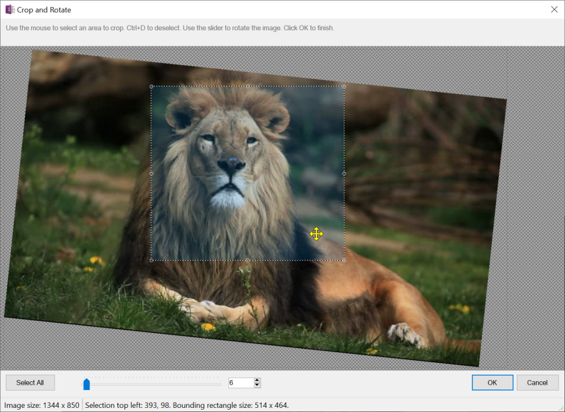

## Add Caption
Add a caption to the selected image by moving the image
into a one-row, one-column table and centering the word "Caption" below the image, which of
course you should edit immediately. If your custom styles has a style named exactly "Caption"
then that style will be applied, otherwise, a default caption style is used.

## Crop and Rotate
Opens an image editing window that allows you to precisely crop an image
by selecting a region, moving that region around the image, and even resizing the region.
Press Ctrl + A to select the entire image. Press Cltr + D to deselect the current selection region.

> 

This dialog also includes a rotate feature that can rotate an image to any angle, beyond just
the 90 degree increments built into OneNote.

## Resize and Advanced Adjustments
Resize images on the page. If one image is selected then you can resize by percentage,
absolute size, or to a preset width with aspect ratio maintained. If more than one image
is selected, or no images are selected, then you can resize them all to a preset width.
The preset width is saved so you don't need to keep entering it if you have a width you
typically use.

By default, the original image size is preserved and only the _rendered view_ of the
image is changed. Untick the _Preserved original size_ checkbox to overwrite the 
storage models of the image which can reduce or increase the amount of data stored on
disk for each image. Image quality can very quickly and easily degrade, so for best
results: change the width and height, untick the _Preserve original size_ checkbox
and leave the quality at 100%.

The opacity, brightness, contrast, saturation, and stylize adjustments will also overwrite
the storage model of the image, overwriting the original.

> 
