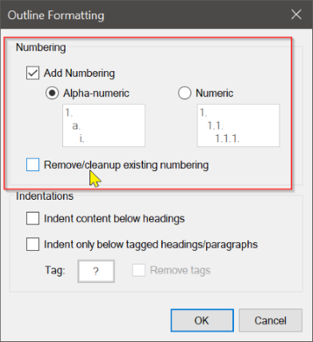
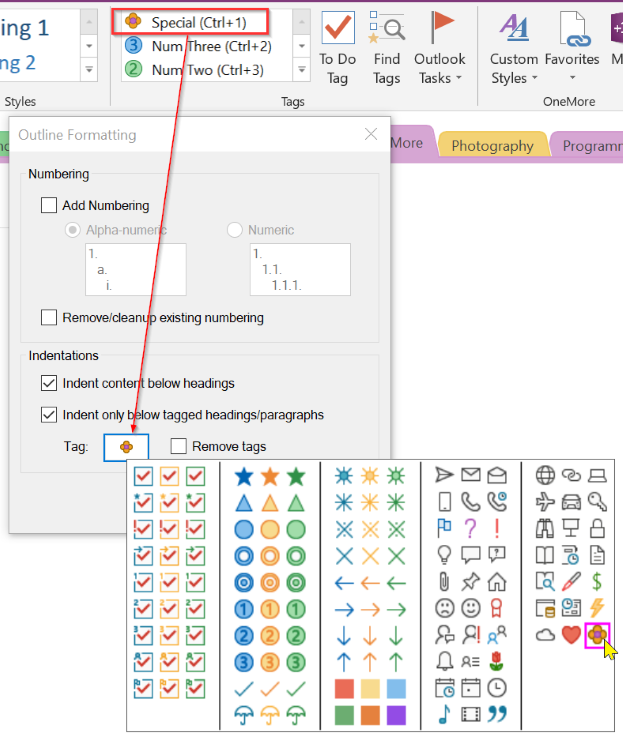

OneNote doesn't offer to number headings like Word does but OneMore can apply numbers to
headings after headings are in place. 

## Outline Formatting
This is a powerful command to apply numbering to headings, with options to indent content
below headings or indent tagged content.

In the dialog's Numbering section, choose to apply numeric or alphanumeric numbering to all
headings on the page. Note that this is a one-time procedure so if you add new or delete old
headings, re-apply numbering using this dialog. The _Remove existing_ checkbox cleans up
numbering that you've applied below; remember to tick this if you've already applied numbering,
otherwise it will double-up!

The numeric numbering will prefix headings with "1.", "1.1.", "1.1.1.", etc. The alphanumeric
numbering will prefix headings with "1.", "a.", "i.", etc.

The last settings you use in this dialog will be preserved. To reset the dialog back to its
default settings, use the Reset Settings item from its system menu, accessed from the title
bar icon.

### Indenting Content

You can also indent paragraphs below all headings, below tagged headings, or
below tagged paragraphs. If you want to indent only below tagged headings or paragraphs,
take advantage of OneNote's tagging-by-keyboard feature by customizing a tag and moving it
up to one of the first eight items in the list of tags; then you can use Ctrl-# to quickly
apply tags to the headings or paragraphs you want before using the Outline Formatting dialog.

