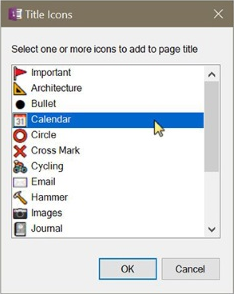

## Arrange Containers
Rearranges the containers on a page either vertically or in columns and rows where columns are equally sized within a given page with. Containers are ordered purely based on the order in which they appear on the OneNote page. OneMore doesn't try to sort them in any intelligent way.

## Add Icon to Page Title
Chose from a selection of icons from the Segoe UI Emoji font to add to the page title;
OneNote automatically displays that icon in the page navigator as well.

> 

## Collapse Outlining
Collapses all headings with indented content.

## Expand Outlining
Expands all headings with indented content.

## Fit Grid to Text
Auto-adjusts the size of the background grid, either lines or squares, to the size of the most commonly used font on the page. There is an option to override the auto calculation and enter a custom value as well. Grids and outlines on the page are not linked in any way in OneNote so grid may not align perfectly with text but the lines should be consistent in relation to the text content. Note this works well for pages that are mostly text; complicated pages with tables and headings will throw off the alignments since grid cannot dynamically change throughout a page.

## Merge pages
Merges two or more pages into a single page. If every selected page contains exactly one outline each then the content of the outlines is concatenated to the outline in the target page, resulting in a single outline. However, if at least one page has multiple outlines then all outlines are appended vertically on the target page to preserve formatting and relative positioning. 

Outlines are used in variety of ways, not the least of which to preserve some conceptual context with other containers on the page based on size and position, so OneMore doesn't attempt to merge containers from multiple pages but instead preserves the layout of containers from each page in a continuous stream in the newly merged page.

Note that you can easily merge to containers by Shift+clicking one container and dragging it on top of the container with which you want the first to be merged. This is a built-in OneNote feature.

## Restore Collapsed Outline
Restores the collapsed date of all collapsible headings since the last Save Collapsed Outline command was invoked. If the state was never saved, all headings are expanded.

## Save Collapsed Outline
Saves the current collapsed state of all collapsible headings; these are headings with indented content. This state can be restored at any time using the Restore Collapsed Outline command.

## Split Page
Splits the current page at each Heading1 or page links. Also, these can be filtered by an optional tag. 

This will create new pages in the current section. If splitting on page links, if the linked pages exists, it must exist in the current section or it will not be found and a new page will be created in the current section; if it is found then the content will be appended to that page. 

## Word Count
Displays the number of words on the current page or in the selected region. The word count may differ - be slightly lower - than the word count reported by Microsoft Word because Word counts things like URLs as a single word but OneMore separates the individual words in the URL. For example, Word reports one word in "https://github.com/OneMore" whereas OneMore counts it as four words.

