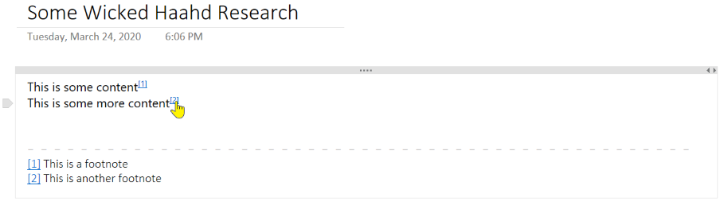

Adding footnotes to a OneNote page seems somehow redundant but consider how often OneNote
is used for research and then used to copy/paste content into Word or print as PDF... yeah,
you get it then.

## Add Footnote (Ctrl + Alt + F)
You can add a footnote anywhere on the page and a reference label is inserted at the current
cursor location and a footnote is added to the bottom of the page. You can then edit the
text in that footnote to your heart's desire. Text colors are based on the page background color.

> 

Note that footnotes are hyperlinked so you jump from the content body down to the text
of a footnote or back up again to the content that references a particular footnote.

## Create Page Map
Generates a report showing all pages that contain links to other pages. This can be
scope to the current section, current notebook, or all notebooks. The report is produced
as a new page in the current section.

By default, links are scanned within the chosen scope, e.g. just the current section.
If you want to include links beyond the current scope, check the _Include cross-notebook
references_ checkbox. Depending on the number of pages and notebooks, this can be time consuming.

## Embed Page and Update Embedded Pages
The _Embed Page_ command embeds the contents of a selected page into the current page at the cursor location. This will only embed the first outline on the page; outlines are the boxes that appear and let you move content around the page. The embedded content is wrapped in a single-cell table with a visible border to indicate that it is embedded content. Click the [Refresh] link in the upper right of the table cell to refresh the embedded contents and synchronize with any changes from the source page. 

The _Update Embedded Pages_ command will refresh and resynchronize the content of all embedded pages on the current page.

## Finish Bidirectional Link
This is step two of two in creating a bidirectional link between phrases on two pages or phrases in separate paragraphs on a single page. Once an anchor is set using the Start Bidirectional Link command, select a second word or phrase in a one paragraph on a second page or in a different paragraph than the anchor and run Finish Bidirectional Link. The anchor phrase is hyperlinked to the final phrase and vice versa.

## Insert QR Code
Converts selected text to a QR code and inserts the QR image into a new paragraph following the selected text. QR codes provide a convenient way to share passwords, Web addresses, any other data (up to 2000 characters).

## Link References To This Page
Finds all pages that mention the title of the current page and creates bi-directional reference links between this page and pages that reference it. All instances of the page title on referring pages are converted to hyperlinks back to this page and a _Linked References_ paragraph is appended to this page with links back to all referring pages. If the current page title has a date prefix of the form yyyy-mm-dd then that is ignored and the remainder of the title is used to search for back references.

Clicking the [Refresh] link next to the _Linked References_ title will rescan pages and rebuild the paragraph.

This uses the built-in OneNote search engine. This engine is notoriously inaccurate. If you know there are pages that reference this page but they are not included in the _Linked References_ section then consider either [rebuilding the Windows Search index or deleting the OneNote cache](Troubleshooting#search-is-flaky).

## Refresh Footnotes
Refreshes all footnote references on the page so their numbers are sequential on the page. 
This is useful when moving content up or down the page.

## Refresh Page References
Updates all pages in scope that reference the current page, refreshing the displayed
title of the current page with any changes made after the initial hyperlinks were set.

## Remove Footnote (Ctrl + Shift + F)
And if you no longer want a footnote, place the cursor over the label or over the footnote
text at the bottom of the page and click the *Remove footnote* command. Voila!

OneMore keeps track of footnotes and will automatically reorder them to keep them numbered
sequentially from the top of the page. If you delete a footnote, it again will renumber
the remaining footnotes so there are no gaps. Pretty slick, huh?

## Replace URLs with Images
Replaces all or selected hyperlinked URLs that reference online images with those referred image. If the image cannot be downloaded, no changes are made. This will only affect URLs where you can read the Web address on the page; it skips URLs where the text differs from the actual address.

## Replace URLs with Web Page Titles
Automatically replaces all or selected hyperlinked URLs with the &lt;title> specified on the 
associated Web pages. This only affects URLs for which the displayed text is the same as the
link address, meaning if you've already customized the displayed text, OneMore will not alter
your changes.

For example, given this URL on a OneNote page: [https://github.com/](https://github.com/)

it would be replaced with its hyperlinked title: [GitHub](https://github.com)

## Start Bidirectional Link
This is step of two in creating a bidirectional link between phrases on two pages or phrases in separate paragraphs on a single page. Select a word or phrase in a one paragraph as an anchor point and run Start Bidirectional Link. Complete the linking by running the Finish Bidirectional Link command
