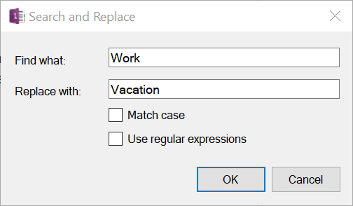
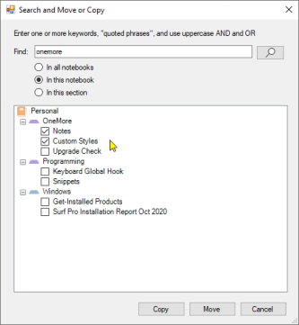
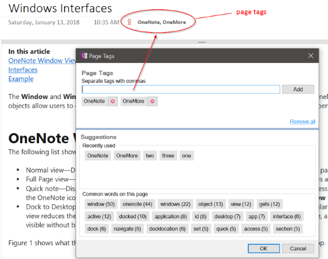
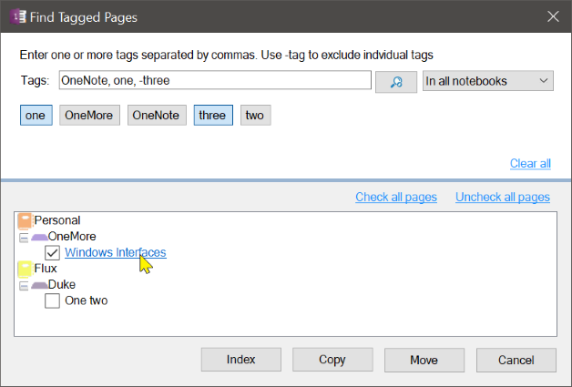

## Search and Replace
Searches the current page for the specified phrase and replaces it with a new phrase. Use standard Regular Expression syntax for advanced searches.
Searches line-by-line so it will not find text that spans paragraphs or table cells.
> 

## Search and Copy/Move
Searches for keywords across pages and copies or moves selected pages (Alt + F) to another section

> 

## Tag Page

Adds one or more arbitrary text tags to a page. Tags can be entered on the fly by typing into the text box. Also chose by clicking tags from a list of recently used tags or tags chosen from the most commonly occurring words on the page. Enter tags separated with a comma; this allows multi-word tags.

Tags will appear below the page title, next to the date and time. Note that while this is a block of text that can be edited, that will not change the tags on the page. Page tags must be added, removed, and edited using the Tag Page dialog. Do not modify this text block manually.

> 

## Find Tagged Pages

Searches pages for the specified page tags. Tags must be separated with a comma. Use the minus operator to exclude pages that contain that tag, e.g. "-Fish" will exclude all pages that are tagged with "Fish".

Searching is done by applying _one or more of the included tags but none of the excluded tags_.

When results are shown, click on each page to force OneNote to navigate to and display that page. 

Select individual pages by ticking the checkbox next to each page. Then create an index page of the selected pages or choose to copy or move those pages to another notebook or another section.

> 

