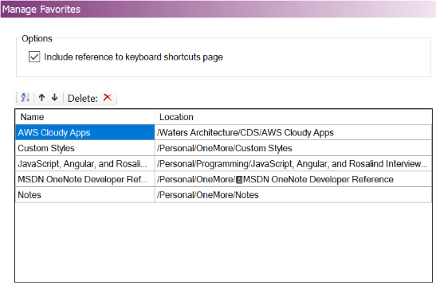
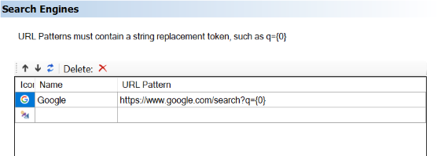
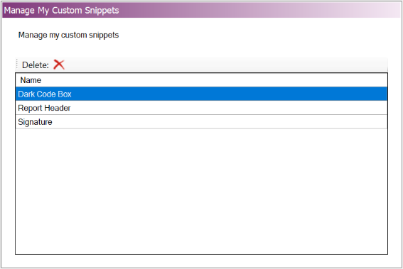

The Settings dialog customizes aspects of the OneMore experience by letting you select options for specific commands.

## General Options
Customizes the general behavior of OneMore

* Enable dynamic menu settings. OneMore attempts to enable/disable command menu items based on the current focus. This can cause OneNote to become
  sluggish if commands are added to the Quick Access Toolbar. Disable this option if you've added OneMore command to the Quick Access Toolbar if
  you experience sluggish responsiveness.

## Context Menu Options
Many of the OneMore commands can be added to the context menu that appears when you right-click on the body of a page.

Note that if you choose one of the "menu" options such as "Edit Menu" then that will be added as a fly-out menu and include all Edit Menu items. But if you choose one of the sub-items, such as "To lowercase" then that item will be added as a top-level context menu item. If you happen to select both then both will be shown, possibly duplicating items.

> 

## Favorites Manager
Use the table to reorder, sort, or delete favorites.

The _Include reference to keyboard shortcuts page_ checkbox is used to add or remove a special link to the Favorites menu that displays a page listing the OneMore and built-in OneNote keyboard shorts - see below.

> 

The first time the keyboard shortcuts Favorite is clicked, OneMore will download and import and keyboard shortcuts reference page under the current section and navigate to that page. It may take a couple of seconds to appear.

Subsequent clicks will simply navigate to that page again.

This page can be moved to any open section or notebook and OneMore will still find it. If the page is deleted, clicking the Favorite link will download it again.

## Rotating Highlighter Options
The rotating highlighter uses an array of colors to highlight selected text. Each time you select text and use this command, it will highlight the selected text using the next color in the array. The highlighter options let you choose which color theme to use

> 

_Note that OneNote must be restarted if highlighter options are changed._

## Ribbon Bar Options
While all commands can be accessed from the More drop-down menu, some common commands can be added to the
ribbon bar for quick single-click access.

> 

_Note that OneNote must be restarted if ribbon bar options are changed._

## Search Engine Options
You can define one or more engines to be shown on the page context menu.

> 

_Note that OneNote must be restarted if search engine options are changed._

### Search Engine Examples
Each engine needs a unique name and a URL pattern. The URL pattern must contains the phrase "{0}" which will be replaced with a selected word or phrase. Some common search engine URL patterns are shown here:

| Name | URL Pattern |
| ---- | ----------- |
| Bing           | https://www.bing.com/search?q={0} |
| Google         | https://www.google.com/search?q={0} |
| Google Books   | https://www.google.com/search?q={0} |
| Google Scholar | https://scholar.google.com/scholar?q={0} |
| Duck Duck Go   | https://duckduckgo.com/?q={0} |
| Dictionary.com | https://www.dictionary.com/browse/{0}?s=t
| WikipediA      | https://en.wikipedia.org/wiki/{0} |

If you define one engine then that is shown directly in the page context menu. If you define
more than one engine, then a submenu is added to the context menu with a list of engines that
you define.

## Custom Snippets Manager
Snippets are automatically ordered alphabetically but you can delete individual snippets using the Snippets Manager

> 
