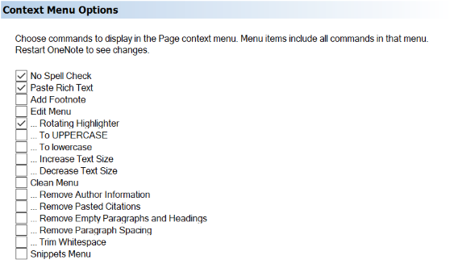
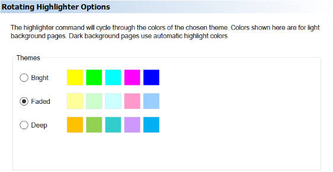
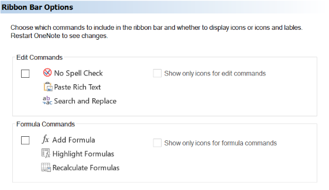

The Settings dialog customizes aspects of the OneMore experience by letting you select options for specific commands.

## Context Menu Options
Many of the OneMore commands can be added to the context menu that appears when you right-click on the body of a page.

> 

## Rotating Highlighter Options
The rotating highlighter uses an array of colors to highlight selected text. Each time you select text and use this command, it will highlight the selected text using the next color in the array. The highlighter options let you choose which color theme to use

> 

## Ribbon Bar Options
While all commands can be accessed from the More drop-down menu, some common commands can be added to the
ribbon bar for quick single-click access.

> 

## Search Engine Options
From the Extras menu, open the Edit Search Engines dialog. You can define one or more engines.
Each engine needs a unique name and a URL pattern. The URL pattern must contains the phrase
"{0}" which will be replaced with a selected word or phrase.

Some common search engine URL patterns are shown here:

| Name | URL Pattern |
| ---- | ----------- |
| Bing           | https://www.bing.com/search?q={0} |
| Google         | https://www.google.com/search?q={0} |
| Google Books   | https://www.google.com/search?q={0} |
| Google Scholar | https://scholar.google.com/scholar?q={0} |
| Duck Duck Go   | https://duckduckgo.com/?q={0} |
| WikipediA      | https://en.wikipedia.org/wiki/{0} |

If you define one engine then that is shown directly in the page context menu. If you define
more than one engine, then a submenu is added to the context menu with a list of engines that
you define.

_Note that you need to restart OneNote when modifying the search engine list.
Sadly, there is no way to dynamically reload the context menu without restarting._

Select a phrase, or place the text cursor in the middle of a word, and choose your search
engine. Your default Web browser is opened, search for your selecte content using the selected
engine.

