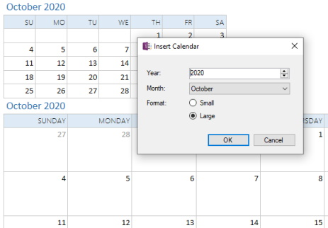
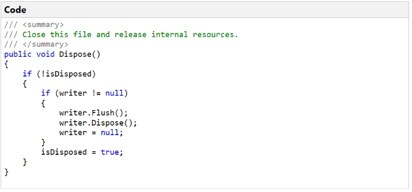
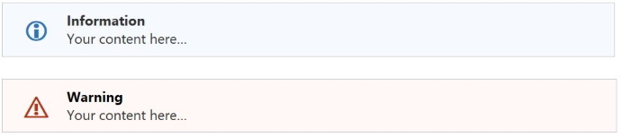

Snippets are bits of contents that can be inserted onto a page and provide repeatable and standardized elements that make editing easier and faster.

_To learn how to save custom snippets of content, refer to the [Favorites](Favorites) page_

## Breadcrumb
Adds a breadcrumb at the top of a page specifying its hierarchical location in the notebook. If the page is moved, this command will update the breadcrumb or re-add it if it was subsequently removed.

## Horizontal Line
Adds a horizontal line below the current paragraph

## Double Horizontal Line
Adds a double-width horizontal line below the current paragraph

## Table of Contents
The Table of Contents command can run in one of three modes:

* Insert a table of contents at the top of the page with hyperlinks to all the standard and custom
  headings on the page. Optionally, add a "top of page" link to each heading on the page to quickly
  jump back to the top of the page. Click the [Refresh] link to rebuild the table of contents, picking
  up any changes made to the page since it was last generated.
* Create a new page at the top of the section with hyperlinks to all pages in the current section
* Create a new page at the top of the section with hyperlinks to all sections in the current
  notebook and optionally include all pages in each section. 

Generates a Table of Contents based on both standard headings and custom user-defined headings
where each line is hyperlinked to its heading and indented according to its heading level.
Text colors are based on the page background color.

> **Table of Contents**  
> [Heading 1](#exampToc)  
> . . [Heading 2](#exampToc)  
> . . . . [Heading 3](#exampToc)

## Calendar
Inserts a monthly calendar for a selected month in either large or small format. The small
format is good for a quick look at a month. The large format is good for entering brief
daily notes.

> 

The _Indent calenar_ option will indent the calendar beneath the header, allowing the header to be collapsed

## Sortable Date (Ctrl + Shift + D)
Inserts the current date in the form yyyy-mm-dd. One common use case is to prefix the title of a new page
with the current date so it is easy to sort and visually identify pages according to the entered date.

## Text Box
Insert a single-cell table. To surround content already on the page, select the content before invoking
this command. This table cell will shrink to the size of the selected content if it is not as wide as
the page.

## Code Box (F6)
Inserts a code box with heading and area for your code. Use the Paste Rich Text command
to paste syntax-highlighted code directly from Visual Studio1.
By default, text colors are based on the page background color.

To wrap content already on the page, select the content before clicking this command or pressing F6. The selected
content will be wrapped inside a new code box. If the background color of all of the selected text is dark and
the page background is light then the shading of the code box is set accordingly; similar if the background color
of all of the selected text is light and the page background is dark.

> 

1 If text copied from Visual Studio is pasted as plain text instead of rich text
when using the Paste Rich Text command (Ctrl+Alt+V) then look at the VS Tools... Options...
Text Editor... Advanced, and tick the box *Copy rich text on copy/cut*.

## Info Block and Warning Block
Inserts an information box or warning box with fully customizable headers and content.
These snippets are actually just nested tables. Text colors are based on the [page background
color](#dark).

> 

## Expand/Collapse
Inserts a collapsable section at the current position on the page. This can be used to hide
secondary or sensitive information on your page. This snippet includes a single-cell table
to which you can add content.

> 

## Status Labels

Insert colored status labels similar to the Status macros found in Confluence. These
are not as smart as the Confluence macros but instead are just simple text with a highlight
background that are fully editable inline.

> 
