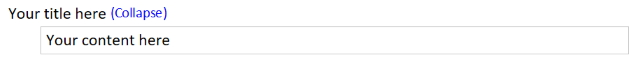

Snippets are bits of contents that can be inserted onto a page and provide repeatable and standardized elements that make editing easier and faster.

## Horizontal Line
Adds a horizontal line below the current paragraph

## Double Horizontal Line
Adds a double-width horizontal line below the current paragraph

## Table of Contents
The Table of Contents command can run in one of three modes:

* Insert a table of contents at the top of the page with hyperlinks to all the standard and custom
  headings on the page. Optionally, add a "top of page" link to each heading on the page to quickly
  jump back to the top of the page.
* Create a new page at the top of the section with hyperlinks to all pages in the current section
* Create a new page at the top of the section with hyperlinks to all sections in the current
  notebook and optionally include all pages in each section. 

Generate a Table of Contents based on both standard headings and custom user-defined headings
where each line is hyperlinked to its heading and indented according to its heading level.
Text colors are based on the page background color.

> **Table of Contents**  
> [Heading 1](#exampToc)  
> . . [Heading 2](#exampToc)  
> . . . . [Heading 3](#exampToc)

## Calendar
Inserts a monthly calendar for a selected month in either large or small format. The small
format is good for a quick look at a month. The large format is good for entering brief
daily notes.

> 

## Sortable Date (Ctrl + Shift + D)
Inserts the current date in the form yyyy-mm-dd. One common use case is to prefix the title of a new page
with the current date so it is easy to sort and visually identify pages according to the entered date.

## Code Box (F6)
Inserts a code box with heading and area for your code. Use the Paste Rich Text command
to paste syntax-highlighted code directly from Visual Studio1.
Text colors are based on the page background color.

> 

1 If text copied from Visual Studio is pasted as plain text instead of rich text
when using the Paste Rich Text command (Ctrl+Alt+V) then look at the VS Tools... Options...
Text Editor... Advanced, and tick the box *Copy rich text on copy/cut*.

## Info Block and Warning Block
Inserts an information box or warning box with fully customizable headers and content.
These snippets are actually just nested tables. Text colors are based on the [page background
color](#dark).

> 

## Expand/Collapse
Inserts a collapsable section at the current position on the page. This can be used to hide
secondary or sensitive information on your page. This snippet includes a single-cell table
to which you can add content.

> 

## Status Labels

Insert colored status labels similar to the Status macros found in Confluence. These
are not as smart as the Confluence macros but instead are just simple text with a highlight
background that are fully editable inline.

> 
