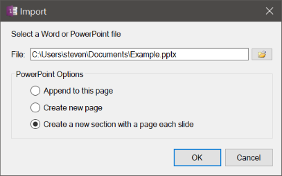
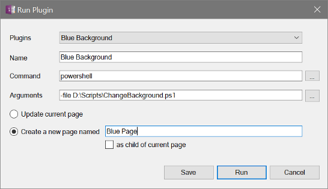
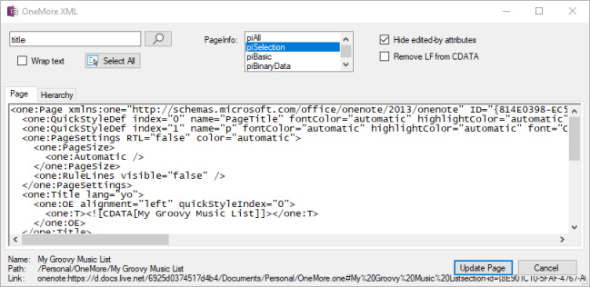

## Archive
Accessible from the context menu for both sections and notebooks, creates a zip file of all pages in the section or notebook, including all images and file attachments on each page. Also fixes the hyperlinks between pages within the context of the archive so the archive can stand on its own as a working directory of HTML files with live hyperlinks.

## Import
Import Word (.docx) or PowerPoint (.pptx), OneNote (.one), or XML (.xml) by either appending content to the current page or creating a new page. 
Additionally, for PowerPoint, each slide can be imported into its own page so you could use OneNote as a PowerPoint presenter by entering full screen mode and using Ctrl-PgDn to move to the next slide.

> 

## Export
Export the current page or selected as HTML, Word, PDF, OneNote .one format, or internal OneNote XML.

If you choose HTML, you will be given the option to export each page as a single .htm file in the specified folder or archive each page into its own sub-folder, optionally with copies of the file attachments on each page.

There are some differences in the way OneMore exports pages from the way OneNote exports pages. If multiple pages are selected, OneMore will create a new file for each page. In comparison, if you choose to export as Word docx, OneNote will append the content from all pages into a single file. 

Note also that there is a difference between an .mht file and an .htm files, where the former has mime-type headers and footers that are not normally present in an HTML file.
 
## Plugins
OneMore has a plugin facility that let you process a page using a program that you write.
This provides a simple way to experiment with page adjustments; it is an experimental
feature.

> _NOTICE: I provide no guarantee, warranty, or promise that you won't screw it up and loose data! It's in your
hands and if you mess up the XML and cause data loss, that's entirely on you. You've been warned._

Given a plugin written in PowerShell then specify the Plugin Command as powershell.exe and use the Arguments
line to specify the -file argument pointing to your plugin script as shown here.

> 

The workflow is very simple: 

1. Create a plugin program that accepts one command line argument;
   the argument will specify the path to a file containing the page XML.
1. Run the Plugin command, specifying the path to the program and any other arguments.
1. The plugin must complete within 20 seconds or it will timeout and be aborted.
1. The plugin must write any desired changes back to the file path it was given.
1. If the plugin completes and _has made changes to the XML file on disk_ then OneMore
   will update the current page with your updated XML from the file;
1. If the plugin completes and has not made changes to the file then no changes are made
   to the current page.
1. If you chose to create a new page then it will be created regardless of whether the plugin updated the XML file.

Any output that your plugin writes to stdout will be captured in the OneMore log file.

Note, if you run the plugin and a Web browser is invoked (IE) showing the XML file contents then
you probably forgot to specify the right arguments to powershell.exe or python.exe.

You can use the special keyword _$name_ in the Page Name field. This will be replaced with
the name of the current page when you invoke the plugin from the Favorites menu or choose it
from the drop-down list. For example, if you're on page "Forecasting" and the Page Name is
set to "Quarterly $name" then the created page when it will be named "Quarterly Forecasting"

The default timeout - time allotted in which a plugin must complete - is 15 seconds. You
can change that by entering the number of seconds into the Timeout field. If set to zero
then the timeout is set to one hour.

The OneNote page schema is defined in the 0336.OneNoteApplication_2013.xsd file in the Properties folder of the project repo.

## XML Dialog (Ctrl + Shift + Alt + X)

Developing OneMore meant reverse-engineering the way Microsoft built OneNote. And it's XML
schema reference documentation was only half the picture. This editor became invaluable
while trying to decipher the behavior and how OneNote manages its page content.

> 

