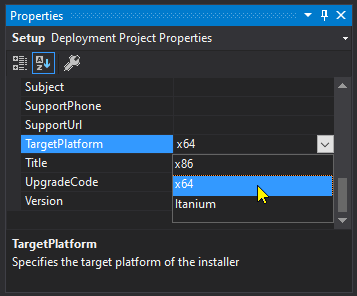

## Online References

* [OneNote Developer Reference Overview 2013](https://docs.microsoft.com/en-us/office/client-developer/onenote/onenote-developer-reference)
* [OneNote Application Interface, API Reference](https://docs.microsoft.com/en-us/office/client-developer/onenote/application-interface-onenote)
* [Office File Formats and PDF downloads](https://msdn.microsoft.com/en-us/library/cc313105(v=office.12).aspx)
* [Adding Custom Galleries to the 2007 Office Fluent User Interface (2007)](https://msdn.microsoft.com/en-us/library/bb736142%28v=office.12%29.aspx?f=255&MSPPError=-2147217396)
* [Creating Custom Ribbon Galleries in Microsoft Excel 2007](https://msdn.microsoft.com/en-us/library/office/dd756403%28v=office.12%29.aspx?f=255&MSPPError=-2147217396)
* [Custom UI Ribbon XML Markup Specification](https://docs.microsoft.com/en-us/openspecs/office_standards/ms-customui/d842006e-3187-4f66-a17d-0819a3cc94b5)
* [imageMso List](https://bert-toolkit.com/imagemso-list.html)

Other Technical Articles

* [Force Window as Top-Most](https://stackoverflow.com/questions/1309855/what-is-powerful-way-to-force-a-form-to-bring-front)
* [High DPI and auto-scaling toolstrips](https://stackoverflow.com/questions/42838120/how-to-proper-auto-scale-toolstrip-in-net)
* [Free Clipboard Viewer](https://www.freeclipboardviewer.com/)
* [Introduction to the Office 2010 Backstage View for Developers](https://msdn.microsoft.com/en-us/library/ee691833.aspx?f=255&MSPPError=-2147217396#odc_Office2010Introduction2OutSpaceUI_DescriptionsAttributesChildInformation)

## Adding a New Command

1. Add a new class file to the Commands folder.
   1. Name the class with a descriptive name of the form <name>Command such as TrimCommand
   1. the file name should match the class name such as TrimCommand.cs.
1. The class should derive from the Command class and be marked _internal_
1. The class should have a public constructor
1. The class should have a public entry point method such as Execute()
1. Add a new method to the AddinCommands.cs file to invoke the command
   1. The name should be derived from the class, replacing Command with Cmd such as TrimCmd

      ```csharp
      public async Task TrimCmd(IRibbonControl control)
          => await factory.Run<TrimCommand>(false);
      ```

1. If the enabled state of the command depends on the OneNote context then use one of the existing
   enablers or add one to the AddInsEnablers.cs file.

1. Add a button control to the Properties\Ribbon.xml file
   1. Specify a unique id and label property
   1. Choose an appropriate imageMso name from [imageMso List](https://bert-toolkit.com/imagemso-list.html)
   1. If an enabler is needed, specify the required one with a getEnabled property
   1. Set the onAction property to the &lt;name&gt;Cmd method added to AddIns.cs

      ```xml
      <button
        id="ribClearBackgroundButton"
        imageMso="PivotTableClearMenu"
        getLabel="GetRibbonLabel"
        getEnabled="GetBodyContext"
        onAction="ClearBackgroundCmd"/>
      ```   

## Compiling and Building Installer

There is no technical different between the 32-bit build and 64-bit builds of OneMore and its DLLs so
OneMore is built as a 32-bit/x86 assembly; this can be used in both x86 and x64 versions of OneNote.

The setup project is configured to generate a 64-bit Windows installer with the idea that there are
very few, if any, 32-bit machines still in use out there. But this 64-bit installer is customized to
support both 64-bit and 32-bit installs of OneNote. So one installer to rule them all!

However, if a 32-bit installer is needed, it can be built in one of two ways

1. Change the TargetPlatform property of the Setup project from x64 to x86 and rebuild

   

2. Or, use the build.ps1 script
   a. By default, this script will build x64 installers
   b. You can optionally specify 86 or 64 on the command line and build just the desired version, e.g.

   C:\Github\OneMore> .\build.ps1 86

Prior to running build.ps1, you must first configure your machine by running this Microsoft tool,
provided specifically to allow later versions of VS to build vdproj projects from the command line.
It only needs to be run once on your machine.

PowerShell syntax:

    cd 'C:\Program Files\Microsoft Visual Studio\2022\Enterprise\Common7\IDE\CommonExtensions\Microsoft\VSI\DisableOutOfProcBuild';
    .\DisableOutOfProcBuild.exe

Note that if you're using a different edition then replace "Enterprise" with your edition, or if you still have VS2019 then change the root path to 'C:\Program Files (x86)\Microsoft Visual Studio\2022'

## A Note on Debugging OneMore

There are two ways to attach the Visual Studio debugger to OneMore. The first is to _instrument_
the source code by adding a call to the Debugger.Launch method where you want to start the debugger:

   ```csharp
   System.Diagnostics.Debugger.Launch();
   ```

This will cause Visual Studio to launch the _attach debugger_ dialog. This is most useful
when you already have the OneMore solution open in Visual Studio so you can attach using
that VS instance with all of the source code and symbols ready to go.

If the attach debugging dialog does not appear and instead a new instance of VS is opened then 
[check this out from Microsoft about the Just in Time Debugger settings](https://docs.microsoft.com/en-us/visualstudio/debugger/debug-using-the-just-in-time-debugger).

The second way is to attach the Visual Studio debugger directly to the running OneMore process.
OneMore runs in a process named dllhost, of which there are many. To identify which instance of
dllhost is the OneMore process, look in the OneMore log file. The process ID is stated in the
first line of the log and is also the first number on each line in the log file.

***
## COM Registration

The installer will register OneMore as a OneNote add-in by writing to the Windows System Registry in the following keys:

```HKEY_CLASSES_ROOT\AppID{88AB88AB-CDFB-4C68-9C3A-F10B75A5BC61}
HKEY_CLASSES_ROOT\CLSID\{88AB88AB-CDFB-4C68-9C3A-F10B75A5BC61}
HKEY_CLASSES_ROOT\onemore\shell\open\command
HKEY_CLASSES_ROOT\River.OneMoreAddIn
HKEY_CLASSES_ROOT\River.OneMoreAddIn.1
HKEY_CURRENT_USER\SOFTWARE\Classes\AppID{88AB88AB-CDFB-4C68-9C3A-F10B75A5BC61}
HKEY_CURRENT_USER\SOFTWARE\Microsoft\Office\OneNote\AddIns\River.OneMoreAddIn
HKEY_CURRENT_USER\SOFTWARE\Microsoft\Windows\CurrentVersion\App Paths\River.OneMoreAddIn.dll
```

A full example .reg file is included in the source repo in the file _register-onemore.reg_

### Development Environment

While developing OneMore, it is easier to run the addin out of the Visual Studio build
paths rather than continually copying bits into the registered deployment folders.

To redirect the registry entries to your VS build paths, run the script setdevreg.ps1, for example:

```
C:\GitHub\OneMore> .\setdevreg.ps1
```

#### Other Interesting Registry Locations

```
HKEY_CURRENT_USER\SOFTWARE\Microsoft\Office\16.0\OneNote (Load Times)
HKEY_CURRENT_USER\SOFTWARE\Microsoft\Office\OneNote (LoadBehavior)
HKEY_LOCAL_MACHINE\SOFTWARE\WOW6432Node\Microsoft\Office\OneNote (LoadBehavior)
```

***
### The COM Interface Timeout

The OneNote Application COM object times out if not used within a reasonable window (somewhere around
a minute mabe?) and, regardless of whether you've wrapped the call in a try/catch, OneNote will abort
the call, display a dialog, and maybe leave OneNote in an unusable state. This can adversely affect a
long-running debugging session.

But in normal operations, OneMore makes every effort to minimize how long it holds on to an
Application instance.

## Dark Colors

OneNote, at times, can be a selfish and uncooperative little brat. If the page background is dark
(brightness is less than 50%) then OneNote increases the brightness of all applied colors by 25%;
the L of the HSL color value is increased by 25. But in another case of Microsoft being "too smart
for their own good", OneNote doesn't allow you to override those colors from the COM API. No matter
what colors you apply to the XML, OneNote will increase the brightness if the page background is
considering "dark". You can, however, still use OneNote's font color button and it will happily
apply any color your choose. Selfish OneNote. Selflish.

> Color adjustments:  
> https://stackoverflow.com/questions/801406/c-create-a-lighter-darker-color-based-on-a-system-color  
> https://docs.microsoft.com/en-us/dotnet/api/system.windows.forms.controlpaint.light?view=netcore-3.1

